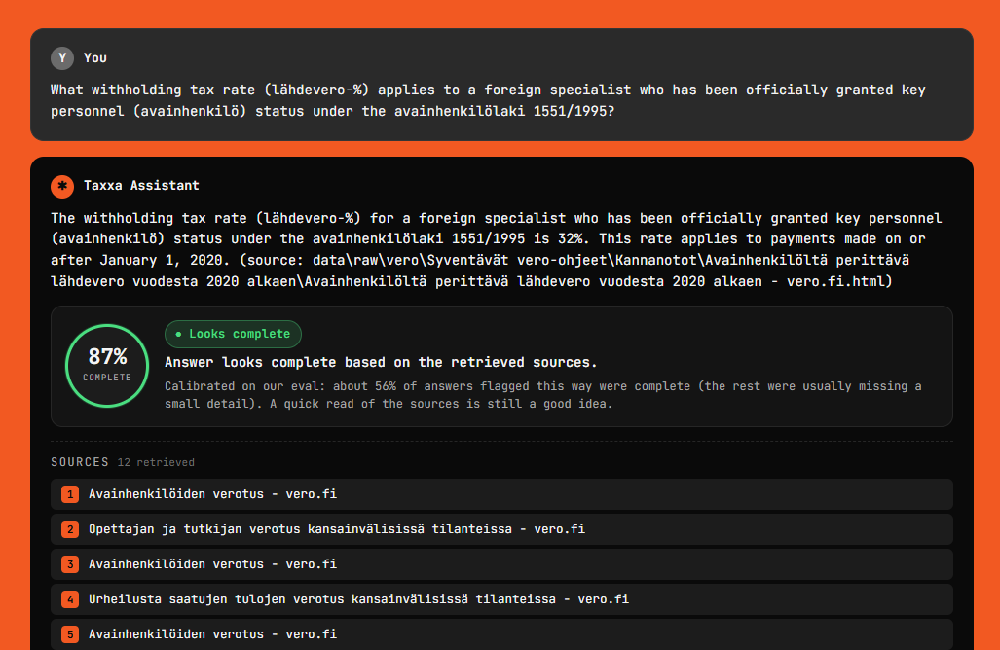
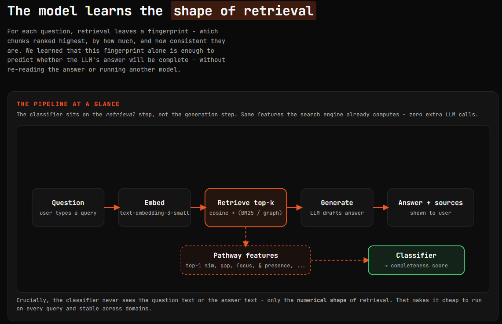
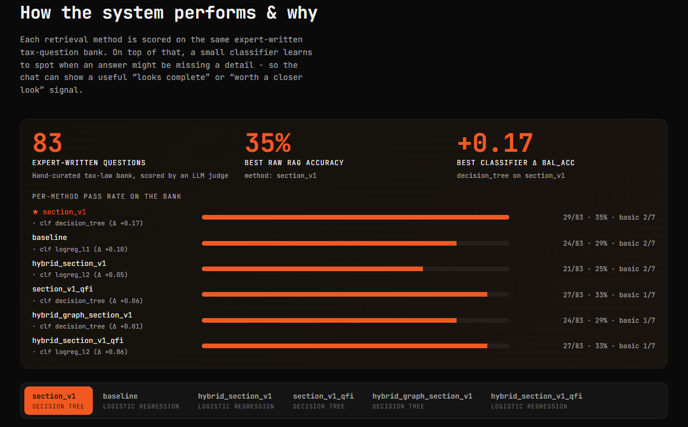
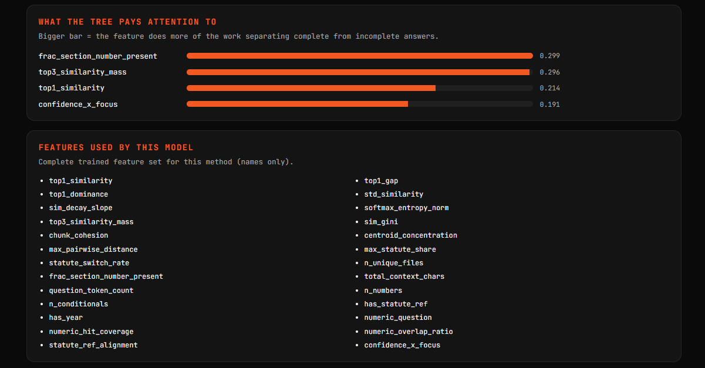

# Prompt Finance Hackathon: Confidence scoring for TAX RAG retrieval.

## Why this matters
A tax accountant can often get a plausible AI answer fast, but still does not know whether that answer is safe to trust.

This project solves that practical gap:
- It answers Finnish tax questions using Finlex + Verohallinto sources.
- It also predicts confidence (how likely the answer is correct), so the user knows when to review carefully and when to move on.

In short: not just "what is the answer," but "should I spend time double-checking this?"

## Confidence, built into the chat experience
Every answer ships with a calibrated confidence score and a plain-language verdict, so the accountant immediately knows whether to trust it or open the source.



The score is not the model's self-reported certainty (those are notoriously miscalibrated). It is produced by a separate classifier that inspects *how* the retrieval went — not what the LLM said about it.

## The retrieval fingerprint — our golden ticket
Every retrieval leaves a unique fingerprint: the shape of the similarity distribution, how tightly the top chunks cohere, whether legal anchors (statute numbers, rare tax terms, numeric thresholds) line up between question and context, whether dense and sparse retrievers agree on the same chunks. Correct answers and wrong answers leave *visibly different* fingerprints — and that signal lives entirely in the retrieval geometry, before the LLM even writes a word.



We extract ~30 such features per question across five families — retrieval certainty, chunk cohesion, lexical anchor alignment, source/statute focus, and hybrid retriever agreement — and let a classifier learn which fingerprints predict PASS vs FAIL on the 83-question judged set. The result is a confidence head that is model-agnostic, cheap to compute, and works on top of any retriever you swap in.

## Interpretable classifiers, not a black box
We deliberately benchmark only models a tax expert can audit: a dummy-majority baseline, a shallow decision tree, and a regularized logistic regression. Each is trained with 5-fold stratified cross-validation; the best balanced-accuracy model wins. Because the features are human-readable (`top1_gap`, `rare_term_recall`, `max_statute_share`, …), the classifier's decision is fully explainable — you can read off *why* a given answer was flagged low-confidence.



## Results on the 83-question bank
Across retrieval variants — baseline sliding-window, section-aware chunking, graph-enhanced, hybrid dense+BM25, and our final query-translated hybrid (`hybrid_section_v1_qfi`) — the fingerprint-based confidence head consistently separates correct from incorrect answers, while the underlying RAG accuracy climbs as retrieval improves.



## What we built
The system has two outputs per question:
1. RAG answer from legal/tax source context.
2. Confidence estimate from a classifier trained on retrieval and question signals on the provided 83 Q&A set.

High-level pipeline:
`download data -> chunk -> embed -> retrieve+answer -> evaluate -> extract signals -> train confidence model`

## Quick start
Run from this folder:
`aalto-hackaton-2026/`

```powershell
uv sync
```

## Run the UI
Start the local frontend demo:

```powershell
uv run python frontend/server.py
```

Optional custom port:

```powershell
uv run python frontend/server.py --port 8765
```

Then open:
- Chat UI: `http://127.0.0.1:8000/`
- Model details: `http://127.0.0.1:8000/admin`
- Next steps page: `http://127.0.0.1:8000/roadmap`

If you use `--port 8765`, replace `8000` with `8765` in the URLs above.

### Required environment variables
Create `.env` with:

```env
OPENAI_API_KEY=...
```

Optional (only if using a custom OpenAI-compatible generation endpoint):

```env
LLM_API_KEY=...
LLM_BASE_URL=...
```

## Models used (and what each one does)
- Embedder: `text-embedding-3-small`
	Turns chunks and queries into vectors for dense retrieval.
- Generator (answer model): `Qwen/Qwen2.5-72B-Instruct` (default)
	Produces the user-facing answer from retrieved legal context.
- Judge (label model): `gpt-4o-mini`
	Scores each question as PASS/FAIL with strict per-key-fact checking.
- Query translation model (for `_qfi` methods): `gpt-4o`
	Rewrites the retrieval query into Finnish before embedding/BM25 to improve
	terminology alignment with Finnish tax-law text.

This separation is intentional: one model answers, another independently
judges correctness, and a third can improve retrieval query quality.

## Top confidence signals we found useful
The confidence model does not look at "vibes" in the answer text. It learns
from retrieval and question structure signals. In practice, the strongest
families are:

- Retrieval certainty
	`top1_similarity`, `top1_gap`, `top1_dominance`, `softmax_entropy_norm`
- Retrieval agreement/cohesion
	`chunk_cohesion`, `centroid_concentration`, `max_pairwise_distance`
- Lexical anchor alignment (critical in tax law)
	`title_token_jaccard_topk`, `body_content_overlap_topk`, `rare_term_recall`,
	`numeric_overlap_ratio`
- Source focus and legal-structure consistency
	`max_statute_share`, `statute_switch_rate`, `frac_section_number_present`
- Hybrid retrieval agreement features (when using hybrid methods)
	`frac_both_in_topk`, `top1_both_retrievers`, `rrf_top1_score`,
	`bm25_top1_score`, `query_num_in_top1_chunk`

Why these matter: wrong answers often come from weak or scattered retrieval,
while correct answers usually have clear top hits, coherent context, and exact
match on legal anchors like numeric thresholds and statute terms.

## Submission flow (concise)

### 1) Download data
```powershell
uv run scripts/fetch_data.py
```

### 2) Build both chunking variants
```powershell
# Naive sliding-window baseline
uv run scripts/build_index.py --method baseline

# Section-based chunking
uv run scripts/build_index.py --method section_v1
```

### 3) Evaluate the final retrieval method (QFI hybrid)
```powershell
uv run scripts/evaluate.py --method hybrid_section_v1_qfi
```

### 4) Extract confidence signals
```powershell
uv run scripts/extract_signals.py --method hybrid_section_v1_qfi
```

### 5) Train confidence classifier
```powershell
uv run scripts/train_classifier.py --method hybrid_section_v1_qfi
```

### 6) (Optional) Compare reports quickly
```powershell
uv run scripts/summary.py
```

## Training and evaluation pipeline (the interesting part)
This project is built as an automatic loop over the full 83-question bank.

1. Pick a method name and retrieval policy
You can change chunking and retrieval freely (baseline, section, graph,
hybrid, hybrid+graph, qfi variants). Methods are isolated by `--method`.

2. Run full Q&A evaluation automatically
`evaluate.py` runs the whole set through RAG, then uses LLM-as-a-judge for
strict grading.

3. Judge scoring is strict by design
For each question, the judge checks required key facts. A question is PASS
only if every required fact passes. Partial correctness is FAIL.

4. Extract signals from retrieval behavior
`extract_signals.py` turns each evaluated question into feature rows.

5. Train confidence classifiers
`train_classifier.py` benchmarks dummy-majority, decision tree, and
regularized logistic regression with 5-fold stratified CV and picks the best
model by balanced accuracy.

6. Iterate
Adjust retrieval/chunking, rerun the same loop, compare reports, repeat.

The optimization target is clear: push judged correctness on the 83 questions
toward 100% while keeping confidence calibration honest (high confidence should
mean high real correctness).

Minimal iteration loop:

```powershell
# Example: try a new method variant end-to-end
uv run scripts/evaluate.py --method hybrid_section_v1_qfi
uv run scripts/extract_signals.py --method hybrid_section_v1_qfi
uv run scripts/train_classifier.py --method hybrid_section_v1_qfi
uv run scripts/summary.py
```

## One-line model summary
We train interpretable confidence models (decision tree + regularized logistic regression) on judge-labeled PASS/FAIL outcomes from an automated full-bank RAG evaluation loop.

## Demo command
Ask one question with the final method:

```powershell
uv run scripts/query_rag.py --method hybrid_section_v1_qfi "What is the capital income tax rate above 30 000 euros?"
```
